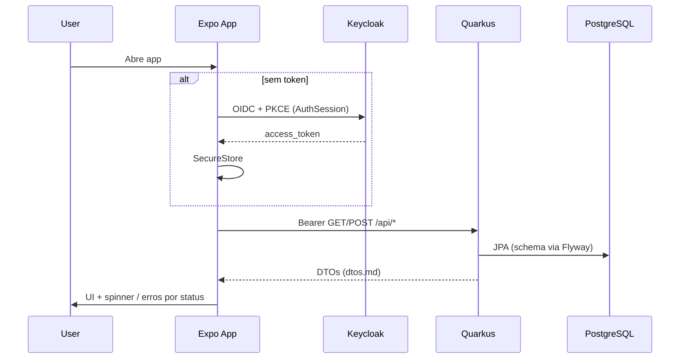

# API Mobile Integration — Design

**Spec**: `.specs/features/api-mobile-integration/spec.md`  
**Context**: `.specs/features/api-mobile-integration/context.md`  
**Status**: Approved (user: execute sem gates de confirmação)

---

## Architecture Overview

Abordagem escolhida: **AuthSession + AuthGate + API-backed hooks** (sem cache).

1. **Backend**: Flyway versiona o schema; Hibernate deixa de gerar DDL.
2. **Mobile auth**: `expo-auth-session` (OIDC Authorization Code + PKCE) contra Keycloak `stringtracker-expo`; tokens em `expo-secure-store`.
3. **Mobile data**: `mobile/services` faz HTTP tipado; `useRackets` busca/muta só via API; store/seed em memória removido.
4. **Routing**: Expo Router — rotas autenticadas atrás de gate; `login` público; `401` → limpa sessão → login.



### Approaches considered

| Approach | Pros | Cons | Verdict |
| -------- | ---- | ---- | ------- |
| A. AuthSession + AuthGate + hooks API | Alinha AD-001/002; sem cache (4A); simples | Token refresh mínimo no MVP | **Escolhido** |
| B. TanStack Query | Loading states prontos | Cache contra 4A; deps extras | Rejeitado |
| C. Token só em memória + fetch nas screens | Menos arquivos | Sem SecureStore; duplicação; frágil | Rejeitado |

---

## Code Reuse Analysis

### Existing Components to Leverage

| Component | Location | How to Use |
| --------- | -------- | ---------- |
| Wire types stub | `mobile/services/api.ts` | Expandir para client HTTP real |
| Domain types | `mobile/hooks/types.ts` | Manter `Racket`, `NewRacketInput`, `DEFAULT_MAX_HOURS`, mensagem 403 |
| Screens UI | `mobile/app/(tabs)/*`, `paywall.tsx` | Trocar fonte de dados; spinner/erro |
| `wearProgressRatio` | `mobile/hooks/types.ts` | Home continua client-side |
| BE DTOs/Resources | `backend/.../dto`, `resource` | Intactos (contrato) |
| Keycloak realm | `backend/keycloak/realm-stringtracker.json` | Client `stringtracker-expo` |
| Resource tests | `backend/src/test/.../resource/*` | Continuam; schema via Flyway no `%test` |

### Integration Points

| System | Integration Method |
| ------ | ------------------ |
| Keycloak | Discovery URL `…/realms/stringtracker`; Auth Code + PKCE |
| Quarkus API | `EXPO_PUBLIC_API_URL` + Bearer |
| PostgreSQL | Flyway `migrate-at-start`; Hibernate `generation=none` |

---

## Components

### Flyway schema

- **Purpose**: Versionar tabelas `users`, `rackets`, `play_sessions`
- **Location**: `backend/src/main/resources/db/migration/V1__create_core_schema.sql`
- **Config**: `quarkus-flyway` + `flyway-database-postgresql`; `migrate-at-start=true`; `hibernate-orm.database.generation=none`
- **Test**: H2 `MODE=PostgreSQL`; Flyway migrate; `generation=none` (sem `drop-and-create`)

### AuthSession + token store

- **Purpose**: Login OIDC, persistir/limpar access token, expor sessão
- **Location**: `mobile/services/auth.ts`, `mobile/services/tokenStore.ts`, `mobile/contexts/AuthContext.tsx`
- **Interfaces**:
  - `login(): Promise<void>`
  - `logout(): Promise<void>`
  - `getAccessToken(): Promise<string | null>`
  - `isPremiumFromToken(accessToken): boolean` — role realm `premium` no JWT payload
- **Deps**: `expo-auth-session`, `expo-crypto`, `expo-secure-store`, `expo-web-browser` (já no projeto)
- **Env**: `EXPO_PUBLIC_KEYCLOAK_URL` (default `http://localhost:8180`), `EXPO_PUBLIC_KEYCLOAK_REALM=stringtracker`, `EXPO_PUBLIC_KEYCLOAK_CLIENT_ID=stringtracker-expo`, `EXPO_PUBLIC_API_URL`

### Auth gate + login screen

- **Purpose**: Bloquear tabs sem sessão; UI mínima de login
- **Location**: `mobile/app/login.tsx`, alterações em `mobile/app/_layout.tsx`
- **Behavior**: sem token → `login`; com token → `(tabs)`; logout → limpa SecureStore → `login`

### HTTP client + API modules

- **Purpose**: `fetch` tipado com Bearer e mapeamento de erros
- **Location**: `mobile/services/http.ts`, expandir `mobile/services/api.ts` (ou `rackets.ts` / `sessions.ts`)
- **Interfaces**:
  - `listRackets(token): Promise<RacketResponse[]>`
  - `createRacket(token, body): Promise<RacketResponse>`
  - `createSession(token, body): Promise<SessionResponse>`
  - `ApiError { status, message, kind: 'unauthorized'|'forbidden'|'not_found'|'validation'|'network'|'unknown' }`
- **403**: `message` = body texto plano (literal freemium)

### `useRackets` (API-backed)

- **Purpose**: Substituir `racketStore` como SoT
- **Location**: `mobile/hooks/useRackets.ts` (+ remover/esvaziar `racketStore.ts`)
- **State**: `rackets`, `activeRacketId` (client-only, default primeiro), `loading`, `error`, `mutating`
- **Actions**: `refresh()`, `addRacket(input)`, `addTrainingHour()`, `logout` via AuthContext; `setPremium` **removido** do SoT (paywall só Alert; `isPremium` do JWT)
- **ID mapping**: wire `number` → UI `string` via `String(id)`

### Screen wiring

- Home / Raquetes / Perfil: spinner, erros por `ApiError.kind`, 401 → `logout()`
- Paywall: CTA simulado; sem mutar premium local

---

## Data Models

### Wire (já em `dtos.md`)

Sem mudança de contrato. TS espelha Java.

### UI `Racket`

```typescript
type Racket = {
  id: string; // String(wire.id)
  brand: string;
  model: string;
  stringModel: string;
  tensionLbs: number;
  dateStrung: string; // YYYY-MM-DD
  totalHoursPlayed: number;
};
```

### JWT premium

Parse base64url do payload do access token; ler `realm_access.roles` (Keycloak) e checar `"premium"`.

---

## Error Handling Strategy

| Error Scenario | Handling | User Impact |
| -------------- | -------- | ----------- |
| 401 | `logout()` + redirect login | Reauth |
| 403 create racket | Alert com body literal | Mensagem freemium |
| 404 session/racket | Alert específico | “Raquete não encontrada” |
| 400 | Alert validação | Dados inválidos |
| Network | Alert rede; limpa lista em falha de GET (sem cache) | Erro + empty/error state |
| Login Keycloak fail | Mensagem na tela login | Tentar de novo |

---

## Risks & Concerns

| Concern | Location | Impact | Mitigation |
| ------- | -------- | ------ | ---------- |
| AD-003 mock SoT conflita com 2A | `mobile/hooks/racketStore.ts` | Dados fantasma | AD-011 supersede; remover seed |
| Android emulator `localhost` | API URL | API unreachable | Doc `10.0.2.2`; `EXPO_PUBLIC_API_URL` |
| H2 vs PG DDL | Flyway V1 | Testes quebram | `MODE=PostgreSQL` + SQL portável |
| Refresh token omitido | Auth MVP | 401 após expiry | Spec: reauth; refresh = deferred |
| `isPremium` BE vs JWT | User.isPremium local | UI ≠ DB | Spec AMI-09: só JWT; sync deferred |
| Test gap mobile HTTP | só `racketStore.test.ts` | Regressões FE | Unit tests em `services/__tests__` + hook |

---

## Tech Decisions

| Decision | Choice | Rationale |
| -------- | ------ | --------- |
| OIDC lib | `expo-auth-session` + SecureStore | Docs Expo 57; PKCE nativo |
| HTTP | `fetch` nativo | Sem axios; MVP |
| Test Flyway | Migrate no `%test` (H2 PG mode) | AD-010 consistente |
| Flyway PG module | `flyway-database-postgresql` | Quarkus 3.20 guide |
| activeRacket | Client-only | Spec assumption |
| Paywall premium | Não muta estado | AMI-10 |

**Project-level:** AD-011 supersede AD-003 (API = SoT).
