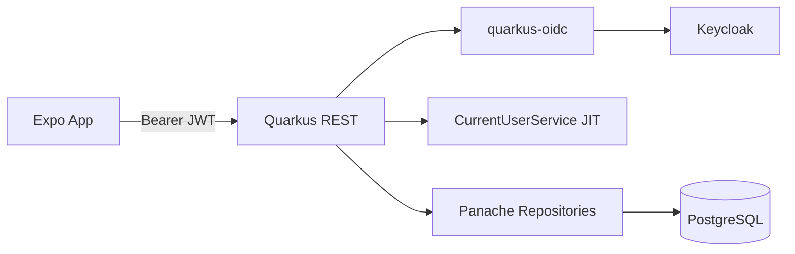

# Backend Quarkus Bootstrap — Design

**Spec**: `.specs/features/backend-bootstrap/spec.md`
**Context**: `.specs/features/backend-bootstrap/context.md`
**Status**: Approved (user: "vai")

---

## Architecture Overview

API Quarkus 3 (Maven) em `backend/`, camadas limpas sob `br.com.stringtracker`, autenticada por Bearer tokens emitidos pelo Keycloak via `quarkus-oidc`.



---

## Code Reuse Analysis

### Existing Components to Leverage

| Component | Location | How to Use |
| --------- | -------- | ---------- |
| Nenhum backend | — | Greenfield |

### Integration Points

| System | Integration Method |
| ------ | ------------------ |
| Keycloak | OIDC discovery + JWKS; realm `stringtracker` |
| PostgreSQL | JDBC `jdbc:postgresql://localhost:5432/stringtracker` |
| Expo | CORS origins `*` em dev |

---

## Components

### Maven Scaffold

- **Purpose**: Build Quarkus com extensões REST, Panache, Postgres, OIDC, SmallRye JWT
- **Location**: `backend/pom.xml`, `backend/src/main/resources/application.properties`

### Entities (model)

- **Location**: `backend/src/main/java/br/com/stringtracker/model/`
- User, Racket, PlaySession (JPA)

### Repositories

- **Location**: `.../repository/`
- `PanacheRepository<T>` CDI beans

### DTOs

- **Location**: `.../dto/`
- Request/response records ou classes com Bean Validation

### CurrentUserService

- **Purpose**: Resolver `User` a partir do `JsonWebToken` (JIT create)
- **Location**: `.../service/CurrentUserService.java`

### RacketResource / PlaySessionResource

- **Location**: `.../resource/`
- REST endpoints protegidos

### Docker / Keycloak

- **Location**: `backend/docker-compose.yml`, `backend/keycloak/realm-stringtracker.json`

---

## Data Models

### User

```java
id: Long
keycloakId: String (unique, not null)  // claim sub
name: String
email: String
isPremium: boolean
```

### Racket

```java
id: Long
user: User (ManyToOne)
brand, model: String
tensionLbs: double
stringModel: String
dateStrung: LocalDate
totalHoursPlayed: double
```

### PlaySession

```java
id: Long
racket: Racket (ManyToOne)
durationMinutes: int
datePlayed: LocalDate
```

---

## Error Handling Strategy

| Error Scenario | Handling | User Impact |
| -------------- | -------- | ----------- |
| Sem/ inválido Bearer | Quarkus OIDC → 401 | Não autenticado |
| Free + ≥1 raquete | 403 + mensagem texto | Upgrade Premium |
| Racket inexistente em session | 404 | Not found |
| durationMinutes ≤ 0 | 400 Bean Validation | Bad request |
| User inexistente no token claims incompletos | JIT com defaults / 400 se email ausente | — |

---

## Risks & Concerns

| Concern | Location | Impact | Mitigation |
| ------- | -------- | ------ | ---------- |
| Java/Maven ausentes no PATH da máquina | host | Build local falha | Documentar JDK 21; validar via container Maven |
| OIDC + smallrye-jwt juntos | pom | Conflito de auth mechanisms | OIDC é o mechanism ativo; smallrye-jwt presente na classpath conforme pedido |
| Dev Services vs compose Keycloak | config | Portas/realms divergentes | Perfis `%dev` / compose documentados |
| Sem testes no monorepo | — | Gate sem runner nativo | QuarkusTest + RestAssured; gate `mvn test` via Docker se preciso |

---

## Tech Decisions

| Decision | Choice | Rationale |
| -------- | ------ | --------- |
| Auth provider | Keycloak + quarkus-oidc service | Pedido do usuário; padrão Quarkus |
| User sync | JIT por `sub` | Sem Admin API no bootstrap |
| Premium | Flag local DB | Modelo JPA pedido; upgrade futuro |
| Hours | minutes/60.0 | Campo em horas |
| REST artifact | `quarkus-rest-jackson` (alias moderne de resteasy-reactive-jackson) | Quarkus 3.20 BOM |
| Java | 21 | LTS atual Quarkus 3.20 |

**Project-level → STATE.md:** AD-001 Keycloak/OIDC, AD-002 package layers, AD-003 JIT User
