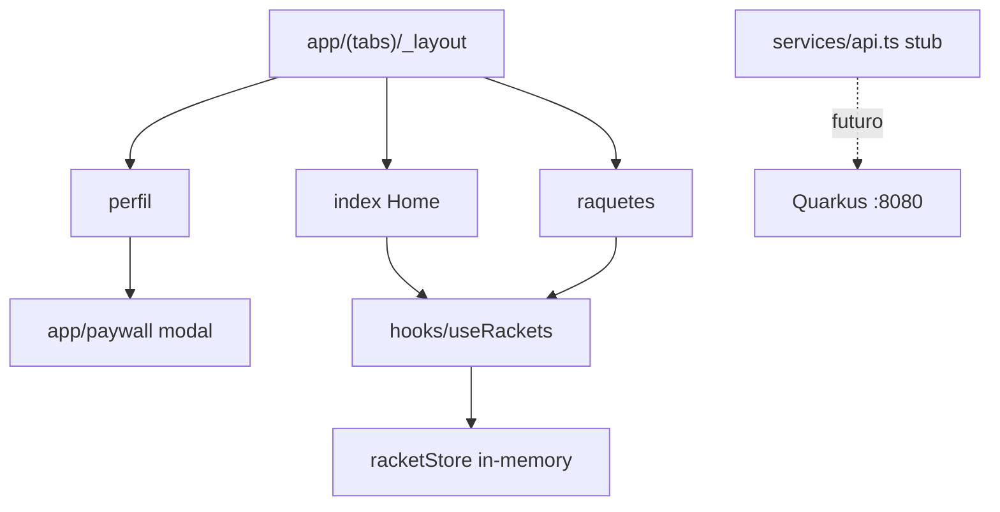

# MVP Shell — Design

**Spec**: `.specs/features/mvp-shell/spec.md`  
**Context**: assumptions da spec + contrato confirmado em `.specs/AGENT_BRIDGE.md` / `api-v1.md`  
**Status**: Approved (usuário confirmou execute 2026-07-12)

---

## Architecture Overview

Shell Expo Router com estado local em memória alinhado ao domínio Quarkus (`Racket` / horas). UI via NativeWind. Integração HTTP fica stubada em `/services` até feature de sync.



**Approach (único, lockado pelo brief + AD-004):** Context-free store module + hook (`useSyncExternalStore`) + telas Expo Router + NativeWind. Sem Redux/Zustand neste MVP.

---

## Code Reuse Analysis

| Component | Location | How to Use |
| --------- | -------- | ---------- |
| Expo Router Tabs/Stack | `app/_layout.tsx`, `app/(tabs)/_layout.tsx` | Adaptar tabs e registrar `paywall` modal |
| SymbolView icons | tabs layout template | Ícones SF/Android nas tabs |
| Path alias `@/*` | `tsconfig.json` | Imports limpos |

### Integration Points

| System | Integration Method |
| ------ | ------------------ |
| Quarkus API | Contrato `api-v1.md`; stub types em `services/`; hook mock agora |
| Keycloak | Fora deste feature (AD-004) |

---

## Components

### racketStore + useRackets

- **Purpose**: Estado em memória de raquetes/treinos com seed realista
- **Location**: `hooks/racketStore.ts`, `hooks/useRackets.ts`
- **Interfaces**:
  - `getSnapshot(): RacketState`
  - `addTrainingHour(racketId: string): void` (+1h = +60 min conceptual)
  - `addRacket(input: NewRacketInput): Racket | { error: 'FREE_LIMIT' }`
  - `useRackets(): { rackets, activeRacket, addTrainingHour, addRacket, isPremium }`
- **Dependencies**: none (pure TS + React)
- **Reuses**: shape alinhado a `RacketResponse` do contrato

### WearProgress

- **Purpose**: Círculo de progresso horas usadas / maxHours
- **Location**: `components/WearProgress.tsx`
- **Interfaces**: `props: { hoursUsed: number; maxHours: number }`
- **Dependencies**: NativeWind
- **Reuses**: none

### Screens

- **Home** `app/(tabs)/index.tsx` — progresso, detalhes corda, FAB "+"
- **Raquetes** `app/(tabs)/raquetes.tsx` — lista + add
- **Perfil** `app/(tabs)/perfil.tsx` — opções + Seja Premium → `/paywall`
- **Paywall** `app/paywall.tsx` — slate-900, planos, CTA simulado

### services/api stub

- **Purpose**: tipos + BASE_URL para futuro cliente Quarkus
- **Location**: `services/api.ts`
- **Interfaces**: types `RacketResponse`, `CreateRacketRequest`, `CreateSessionRequest`; `API_BASE_URL`

---

## Data Models

```typescript
type Racket = {
  id: string
  brand: string
  model: string
  stringModel: string
  tensionLbs: number
  dateStrung: string // YYYY-MM-DD
  totalHoursPlayed: number
}

type RacketState = {
  rackets: Racket[]
  activeRacketId: string | null
  isPremium: boolean // mock local; paywall não altera ainda
}

const DEFAULT_MAX_HOURS = 30 // client-only (contrato BE)
```

**Seed:** Babolat Pure Drive, Luxilon Alu Power, 52 lbs, 12h, dateStrung recente.

**Relationships:** 1 active racket; free limit 1 racket se `!isPremium` (espelha regra BE).

---

## Error Handling Strategy

| Error Scenario | Handling | User Impact |
| -------------- | -------- | ----------- |
| Sem raquete ativa | Empty state na Home | CTA ir para Raquetes |
| Cancelar Alert do + | no-op | sem mudança |
| Limite free no add | Alert com mensagem alinhada ao BE 403 | bloqueia 2ª raquete |
| hours ≥ maxHours | clamp visual 100%, mostra número real | aviso visual |

---

## Risks & Concerns

| Concern | Location | Impact | Mitigation |
| ------- | -------- | ------ | ---------- |
| NativeWind setup frágil no Expo 57 | root configs | classes não aplicam | Seguir docs oficiais; gate visual + tsc |
| `Alert.prompt` só iOS | raquetes add | Android sem prompt | Add com defaults pré-definidos via Alert.alert |
| Sem suite de testes no repo | — | regressões | Unit no store; UI = build gate `tsc` |
| Template dead code (Themed, two.tsx) | components/app | confusão | Remover só rotas substituídas; não limpar everything |

---

## Tech Decisions

| Decision | Choice | Rationale |
| -------- | ------ | --------- |
| Estado global | module store + useSyncExternalStore | Simples, sem Provider, fácil trocar por API |
| Progresso | círculo CSS/View | Spec preferiu círculo |
| + treino | +1h (60 min) | Alinha a `durationMinutes: 60` do contrato |
| Limite free no mock | espelha BE | Paywall/UX consistente |
| Testes | unit no store; UI sem e2e neste feature | Repo sem testes; domínio é o risco |

**Project-level:** já em STATE (AD-001..005). Nenhum AD novo além do já registrado.
